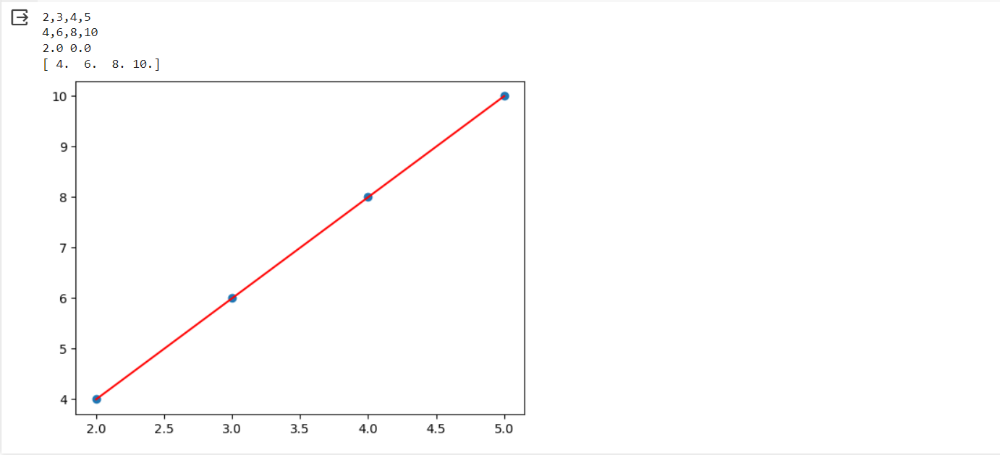

# Implementation of Univariate Linear Regression
NAME : ALIYA SHEEMA

REFERENCE NUMBER : 23005529

DEPARTMENT : AIDS

## AIM :
To implement univariate Linear Regression to fit a straight line using least squares.
## EQUIPMENT'S REQUIRED :
1.	Hardware – PCs
2.	Anaconda – Python 3.7 Installation / Moodle-Code Runner
## ALGORITHM :
1.	Get the independent variable X and dependent variable Y.
2.	Calculate the mean of the X -values and the mean of the Y -values.
3.	Find the slope m of the line of best fit using the formula.
 
4.	Compute the y -intercept of the line by using the formula:
  
5.	Use the slope m and the y -intercept to form the equation of the line.
6.	Obtain the straight line equation Y=mX+b and plot the scatterplot.
## PROGRAM :
```
# Program to QR decomposition using the Gram-Schmidt method
# Developed by: ALIYA SHEEMA
# RegisterNumber: 23005529

import numpy as np
import matplotlib.pyplot as plt
x= np.array(eval(input()))
y=np.array(eval(input()))
X=np.mean(x)
Y=np.mean(y)
num,den=0,0
for i in range (len(x)):
    num +=((x[i]-X)*(y[i]-Y))
    den += ((x[i]-X)**2)
m=num/den
b=Y-m*X
print(m,b)
Ypred = m*x + b
print(Ypred)

plt.scatter(x,y)
plt.plot(x,Ypred,color='red')
plt.show()

```
## OUTPUT :




## RESULT :
Thus the univariate Linear Regression was implemented to fit a straight line using least squares.
